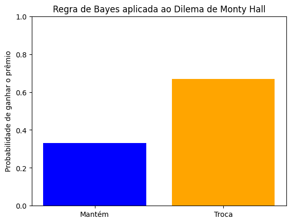

# O dilema de Monty Hall

Ocasionalmente, volta à baila o dilema de *Monty Hall*, que consiste em
um *game show*, onde o participante que adivinhar em qual das três
portas se esconde o prêmio valioso, leva um carro zero quilômetro. Após
o participante escolher uma opção, o apresentador abre uma das portas
restantes, que se encontra vazia, e pergunta se o participante deseja
manter ou modificar a escolha inicial.

### Probabilidade condicional

O carro pode estar escondido atrás de qualquer uma das três portas . A
probabilidade inicial, denominada *\"a priori\"*, antes que seja
fornecida alguma nova informação, é definida por:

*p(p1) = p(p2) = p(p3) = 1/3.*

Caso o carro realmente esteja atrás da porta escolhida pelo
participante, por exemplo, a porta 1 (p1), a probabilidade de que o
apresentador abra a porta 2, denotada por p(a2), é igual a 0.5. Logo,
aplicando a Regra de Bayes:

*p(p1\|a2) = p(a2\|p1)*p(p1)/p(a2) = (1/2*1/3)/1/2 = 1/3.*

A probabilidade de que o apresentador escolha a porta 2, caso realmente
o prêmio esteja contido nela, é igual a 0. Aplicando a Regra de Bayes:

*p(p2\|a2) = p(a2\|p2)*p(p2)/p(a2)=(0*1/3)/1/2 = 0.*

A probabilidade do apresentador abrir a porta 2, caso o prêmio esteja na
porta 3 é igual a 1. Aplicando a Regra de Bayes:

*p(p3\|a2)=p(a2\|p3)/p(a2)=(1x1/3)/1/2=2/3.*

A soma das probabilidades antes e depois da aplicação da Regra de Bayes
é a mesma:

*1 = (1/3 + 1/3 +1/3) = (1/3 + 0 + 2/3)*

Novas informações alteram a probabilidade *\"a priori\"*. O participante
deve trocar a opção da porta 1 para a porta 3, presumindo que esta seja
a sua escolha inicial e o apresentador tenha aberto a porta 2.

### \"Should I stay or should I go?\"

Em termos práticos, o participante vive um dilema: manter a escolha
inicial ou trocar à luz de novas informações? Mesmo que desconheça as
regras de inferência bayesiana, pode utilizar a frequência natural.

O psicólogo alemão Gerd Gigerenzer sugere pensar o problema com 3 participantes. Suponha que o
prêmio esteja na porta 2. O participante 1 escolhe a porta 3, então o
apresentador abre a porta 1. O participante 2 escolhe a porta 1, então o
apresentador abre a porta 3. O participante 3 escolhe a porta 2, então o
apresentador pode abrir a porta 1 ou 3. Logo, se os participantes 1 e 2
trocarem de porta, levam o prêmio. Se o participante 3 trocar, perde.

Em conclusão, a opção pela troca é favorável em 2 de 3 casos. A
probabilidade de ganhar o prêmio caso troque de porta é igual a 2/3 ou
equivalente a 67%.

### Simulação

``` python
import random
import matplotlib.pyplot as plt

class MontyHallBayes:
    def __init__(self, num_trials):
        self.num_trials = num_trials
        self.stay_wins = 0
        self.switch_wins = 0

    def run_simulation(self):
        for _ in range(self.num_trials):
            # Passo 1: Coloque o prêmio aleatoriamente atrás de uma das três portas
            doors = [0, 0, 0]
            prize_door = random.randint(0, 2)
            doors[prize_door] = 1
            
            # Passo 2: O participante escolhe uma porta aleatoriamente
            choice = random.randint(0, 2)
            
            # Passo 3: O apresentador abre uma das portas restantes que não tem o prêmio
            remaining_doors = [i for i in range(3) if i != choice and doors[i] == 0]
            monty_opens = random.choice(remaining_doors)
            
            # Cálculo das probabilidades usando a Regra de Bayes
            P_prize_given_stay = self.bayes_rule(choice, monty_opens, prize_door, stay=True)
            P_prize_given_switch = self.bayes_rule(choice, monty_opens, prize_door, stay=False)

            # Decide se mantém ou troca com base nas probabilidades
            if P_prize_given_stay > P_prize_given_switch:
                if doors[choice] == 1:
                    self.stay_wins += 1
            else:
                switch_choice = [i for i in range(3) if i != choice and i != monty_opens][0]
                if doors[switch_choice] == 1:
                    self.switch_wins += 1

    def bayes_rule(self, choice, monty_opens, prize_door, stay):
        """
        Aplica a Regra de Bayes para calcular a probabilidade condicional de ganhar
        """
        if stay:
            P_prize_given_choice = 1/3 if choice == prize_door else 0
        else:
            switch_choice = [i for i in range(3) if i != choice and i != monty_opens][0]
            P_prize_given_choice = 1 if switch_choice == prize_door else 0

        P_monty_given_choice = 1/2 if choice == prize_door else 1
        P_choice = 1/3

        # Calcula a probabilidade condicional
        P_prize_given_choice_and_monty = (P_prize_given_choice * P_monty_given_choice) / P_choice
        return P_prize_given_choice_and_monty

    def plot_results(self):
        # Calcula as probabilidades de ganhar mantendo a escolha ou trocando
        stay_prob = self.stay_wins / self.num_trials
        switch_prob = self.switch_wins / self.num_trials

        # Exibe os resultados em um gráfico de barras
        labels = ['Mantém', 'Troca']
        probabilities = [stay_prob, switch_prob]

        plt.bar(labels, probabilities, color=['blue', 'orange'])
        plt.ylabel('Probabilidade de ganhar o prêmio')
        plt.title('Regra de Bayes aplicada ao Dilema de Monty Hall')
        plt.ylim(0, 1)
        plt.show()

# Executa a simulação
num_trials = 10000
simulation = MontyHallBayes(num_trials)
simulation.run_simulation()
simulation.plot_results()
```



**Referências:**

Gigerenzer, G. (2002). *Calculated risks: how to know when numbers deceive you*. New York: Simon and Schuster.

Gigerenzer, G. (2014). *Risk savvy: How to make good decisions*. New York: Viking. 

